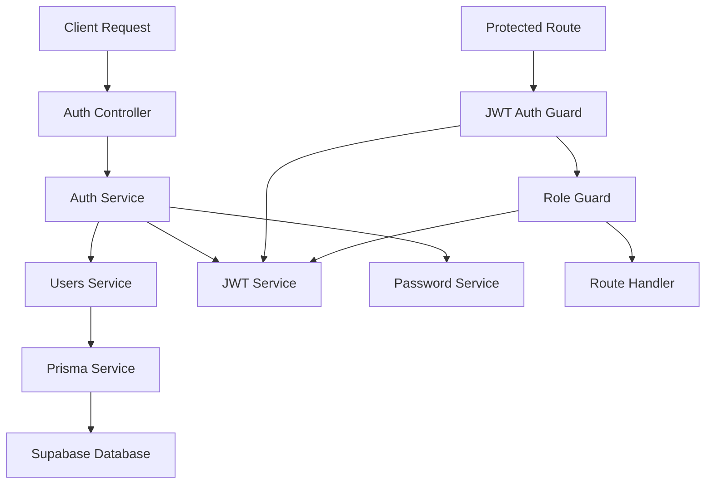

# Design Document: Authentication System

## Overview

This design document outlines the implementation of a comprehensive JWT-based authentication system for the NestJS backend. The system provides secure user registration, login, and role-based access control using industry best practices including bcrypt password hashing, JWT tokens with refresh token rotation, and modular architecture.

The authentication system integrates with the existing Supabase database through Prisma ORM and leverages the profiles table for user management. It implements a dual-token strategy with short-lived access tokens and longer-lived refresh tokens to balance security and user experience.

## Architecture

The authentication system follows NestJS modular architecture principles with clear separation of concerns:



### Core Modules

1. **AuthModule**: Handles authentication logic, token generation, and validation
2. **UsersModule**: Manages user profile operations and database interactions
3. **Guards**: Implements route protection and role-based access control

## Components and Interfaces

### Authentication Service

The AuthService orchestrates the authentication flow and token management:

```typescript
interface AuthService {
  register(registerDto: RegisterDto): Promise<AuthResponse>;
  login(loginDto: LoginDto): Promise<AuthResponse>;
  refreshTokens(refreshToken: string): Promise<TokenResponse>;
  validateUser(email: string, password: string): Promise<UserProfile | null>;
}
```

### Users Service

The UsersService handles user profile management:

```typescript
interface UsersService {
  create(userData: CreateUserDto): Promise<UserProfile>;
  findByEmail(email: string): Promise<UserProfile | null>;
  findById(id: string): Promise<UserProfile | null>;
  updateProfile(id: string, updateData: UpdateUserDto): Promise<UserProfile>;
}
```

### JWT Service

The JwtService manages token generation and validation:

```typescript
interface JwtService {
  generateTokens(payload: JwtPayload): Promise<TokenPair>;
  verifyAccessToken(token: string): Promise<JwtPayload>;
  verifyRefreshToken(token: string): Promise<JwtPayload>;
  extractTokenFromHeader(authHeader: string): string | null;
}
```

### Password Service

The PasswordService handles secure password operations:

```typescript
interface PasswordService {
  hashPassword(password: string): Promise<string>;
  comparePasswords(
    plainPassword: string,
    hashedPassword: string,
  ): Promise<boolean>;
  validatePasswordStrength(password: string): ValidationResult;
}
```

## Data Models

### Data Transfer Objects

**RegisterDto**:

```typescript
class RegisterDto {
  @IsEmail()
  email: string;

  @IsString()
  @MinLength(8)
  @Matches(/^(?=.*[a-z])(?=.*[A-Z])(?=.*\d)(?=.*[@$!%*?&])[A-Za-z\d@$!%*?&]/)
  password: string;

  @IsString()
  @IsNotEmpty()
  full_name: string;
}
```

**LoginDto**:

```typescript
class LoginDto {
  @IsEmail()
  email: string;

  @IsString()
  @IsNotEmpty()
  password: string;
}
```

**AuthResponse**:

```typescript
interface AuthResponse {
  access_token: string;
  refresh_token: string;
  user: {
    id: string;
    email: string;
    role: UserRole;
    full_name: string;
  };
}
```

### JWT Payload Structure

```typescript
interface JwtPayload {
  sub: string; // user ID
  email: string;
  role: UserRole;
  iat: number;
  exp: number;
}
```

### Database Integration

The system leverages the existing Prisma schema with the profiles table:

```prisma
model profiles {
  id         String     @id @db.Uuid
  email      String     @unique
  role       user_role? @default(customer)
  full_name  String?
  avatar_url String?
  updated_at DateTime?  @default(now()) @db.Timestamptz(6)
  // ... other fields
}
```

## Correctness Properties

_A property is a characteristic or behavior that should hold true across all valid executions of a system-essentially, a formal statement about what the system should do. Properties serve as the bridge between human-readable specifications and machine-verifiable correctness guarantees._

After analyzing the acceptance criteria, I've identified the following testable properties while eliminating redundancy:

**Property 1: User Registration Creates Profile**
_For any_ valid registration data (email, password, full_name), registering should create a new user profile in the database with the provided information
**Validates: Requirements 1.1**

**Property 2: Duplicate Email Prevention**
_For any_ existing user email, attempting to register with the same email should fail and prevent duplicate registration
**Validates: Requirements 1.2**

**Property 3: Email Format Validation**
_For any_ invalid email format, the registration system should reject the input and return appropriate validation errors
**Validates: Requirements 1.3**

**Property 4: Password Strength Enforcement**
_For any_ weak password (lacking complexity requirements), the registration system should reject the password and return validation errors
**Validates: Requirements 1.4**

**Property 5: Password Hashing Security**
_For any_ valid password, the system should hash it using bcrypt before storage and never store plain text passwords in the database
**Validates: Requirements 1.5, 3.1, 3.3**

**Property 6: Registration Token Generation**
_For any_ successful registration, the system should return both access and refresh tokens with proper expiration times and payload structure
**Validates: Requirements 1.6, 4.1, 4.2, 2.5**

**Property 7: Authentication Success**
_For any_ valid login credentials, the authentication system should validate the user and return JWT tokens
**Validates: Requirements 2.1, 2.4**

**Property 8: Authentication Failure Security**
_For any_ invalid credentials or non-existent email, the authentication system should return an authentication error without revealing user existence details
**Validates: Requirements 2.2, 2.3**

**Property 9: Password Validation Round Trip**
_For any_ password, hashing then comparing should validate correctly, and comparing with wrong passwords should fail
**Validates: Requirements 3.2**

**Property 10: Token Validation and Expiration**
_For any_ JWT token, validation should verify signature and expiration, rejecting expired or invalid tokens with appropriate errors
**Validates: Requirements 4.3, 4.4**

**Property 11: Route Protection Without Token**
_For any_ protected route accessed without a token, the Auth Guard should reject the request with 401 Unauthorized
**Validates: Requirements 5.1**

**Property 12: Route Protection With Invalid Token**
_For any_ protected route accessed with an invalid token, the Auth Guard should reject the request with 401 Unauthorized
**Validates: Requirements 5.2**

**Property 13: Route Access With Valid Token**
_For any_ protected route accessed with a valid token, the Auth Guard should allow access and extract user information for the route handler
**Validates: Requirements 5.3, 5.4**

**Property 14: Role-Based Access Control**
_For any_ route requiring admin role, access should be granted only to users with admin role and denied to users with customer role (403 Forbidden)
**Validates: Requirements 6.1, 6.2, 6.3, 6.4**

**Property 15: Error Message Quality**
_For any_ authentication failure or validation error, the system should return descriptive, field-specific error messages with appropriate HTTP status codes
**Validates: Requirements 8.1, 8.2, 8.4**

**Property 16: DTO Validation**
_For any_ invalid DTO data, the system should validate all DTOs and return validation errors for invalid data
**Validates: Requirements 9.4**

<function_calls>
<invoke name="prework">
<parameter name="featureName">authentication-system

## Error Handling

The authentication system implements comprehensive error handling with appropriate HTTP status codes and user-friendly messages:

### Error Categories

1. **Validation Errors (400 Bad Request)**
   - Invalid email format
   - Weak passwords
   - Missing required fields
   - Invalid DTO structure

2. **Authentication Errors (401 Unauthorized)**
   - Invalid credentials
   - Expired tokens
   - Missing authentication tokens
   - Invalid token signatures

3. **Authorization Errors (403 Forbidden)**
   - Insufficient role permissions
   - Access denied to protected resources

4. **Conflict Errors (409 Conflict)**
   - Duplicate email registration
   - Resource already exists

5. **Server Errors (500 Internal Server Error)**
   - Database connection failures
   - Unexpected system errors
   - Password hashing failures

### Error Response Format

```typescript
interface ErrorResponse {
  statusCode: number;
  message: string | string[];
  error: string;
  timestamp: string;
  path: string;
}
```

### Security Considerations

- Authentication errors do not reveal whether a user exists
- Password validation errors are generic to prevent enumeration attacks
- Server errors are logged but return generic messages to users
- All errors include correlation IDs for debugging

## Testing Strategy

The authentication system employs a dual testing approach combining unit tests and property-based tests for comprehensive coverage:

### Property-Based Testing

Property-based tests validate universal correctness properties across all inputs using **fast-check** library:

- **Minimum 100 iterations** per property test to ensure thorough coverage
- Each property test references its corresponding design document property
- Tag format: **Feature: authentication-system, Property {number}: {property_text}**
- Focus on universal behaviors that should hold for all valid inputs

**Example Property Test Structure**:

```typescript
describe('Authentication Properties', () => {
  it('should hash any valid password using bcrypt', async () => {
    // Feature: authentication-system, Property 5: Password Hashing Security
    await fc.assert(
      fc.asyncProperty(
        fc.string({ minLength: 8, maxLength: 100 }),
        async (password) => {
          const hashedPassword = await passwordService.hashPassword(password);
          expect(hashedPassword).not.toBe(password);
          expect(await bcrypt.compare(password, hashedPassword)).toBe(true);
        },
      ),
      { numRuns: 100 },
    );
  });
});
```

### Unit Testing

Unit tests verify specific examples, edge cases, and integration points:

- **Registration endpoint tests**: Valid/invalid inputs, duplicate emails
- **Login endpoint tests**: Correct/incorrect credentials, non-existent users
- **Guard tests**: Token validation, role checking, route protection
- **Service tests**: Password hashing, JWT generation, user creation
- **Integration tests**: End-to-end authentication flows

### Test Configuration

- **Framework**: Jest with NestJS testing utilities
- **Property Testing**: fast-check library for property-based tests
- **Database**: In-memory SQLite for isolated testing
- **Mocking**: Minimal mocking to test real functionality
- **Coverage**: Aim for >90% code coverage with focus on critical paths

### Testing Dependencies

Required packages for comprehensive testing:

```json
{
  "devDependencies": {
    "@nestjs/testing": "^11.0.1",
    "fast-check": "^3.15.0",
    "jest": "^30.0.0",
    "supertest": "^7.0.0"
  }
}
```

## Implementation Dependencies

The authentication system requires the following npm packages:

### Core Dependencies

```bash
npm install @nestjs/jwt @nestjs/passport passport passport-jwt bcrypt
npm install class-validator class-transformer
```

### Development Dependencies

```bash
npm install --save-dev @types/bcrypt @types/passport-jwt fast-check
```

### Package Purposes

- **@nestjs/jwt**: JWT token generation and validation
- **@nestjs/passport**: NestJS integration with Passport.js
- **passport-jwt**: JWT strategy for Passport
- **bcrypt**: Secure password hashing
- **class-validator**: DTO validation decorators
- **class-transformer**: Object transformation utilities
- **fast-check**: Property-based testing library

## Security Best Practices

The design incorporates industry-standard security practices:

1. **Password Security**
   - bcrypt hashing with salt rounds (12+)
   - Password strength requirements
   - No plain text storage

2. **Token Security**
   - Short-lived access tokens (15 minutes)
   - Secure refresh token rotation
   - JWT signature verification
   - Proper token expiration handling

3. **API Security**
   - Input validation on all endpoints
   - Rate limiting (to be implemented)
   - CORS configuration
   - Secure HTTP headers

4. **Error Handling**
   - No information leakage in error messages
   - Consistent error responses
   - Proper logging without sensitive data

5. **Database Security**
   - Parameterized queries via Prisma
   - Connection string security
   - Row-level security (Supabase RLS)
